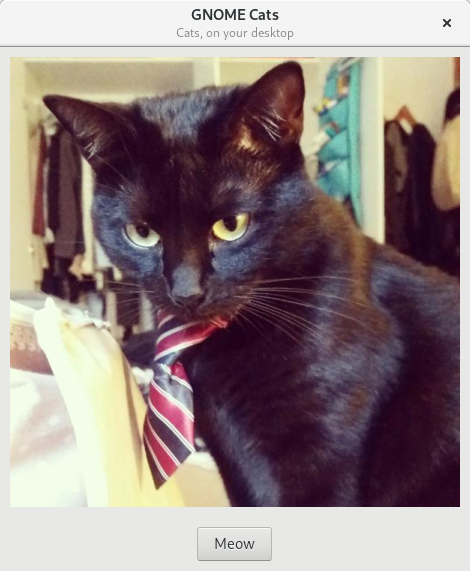

# GNOME Cats

Simple GTK3 application that brings you cats to your desktop.

## Install

    $ git clone https://gitlab.com/JuanjoSalvador/gnome-cats.git && cd gnome-cats
    $ pip3 install ./gnome-cats
    $ gnome-cats

## Development

    $ make install
    $ make run
